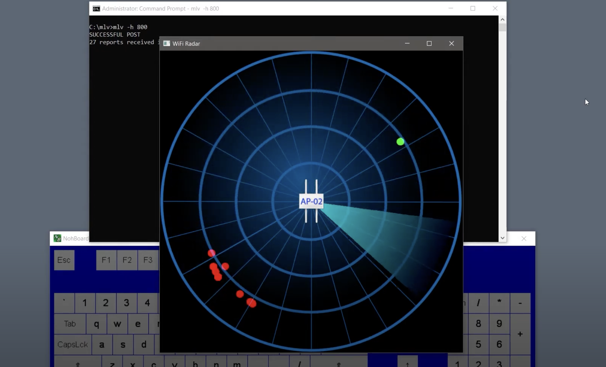

PRE-REQs

1 - functional Meraki wireless network with at least one access point

2 - admin access to the Meraki cloud portal

3 - Location API enabled for your network (https://developer.cisco.com/meraki/scanning-api/#!enable-scanning-api)

4 - a host on your network set up to allow Meraki to send you data via HTTPS (self-signed certs do not work...)

5 - an underlying database to hold the data

This project was a learning exercise with the goals of exploring the Meraki Location API, using (and learning) C# to do so, and then doing something with the data (in this case, visualizing it via OpenGL).

There is a very short video overview here:

https://www.youtube.com/channel/UCgir-VrOw32K_XV34CAUKDw/featured

